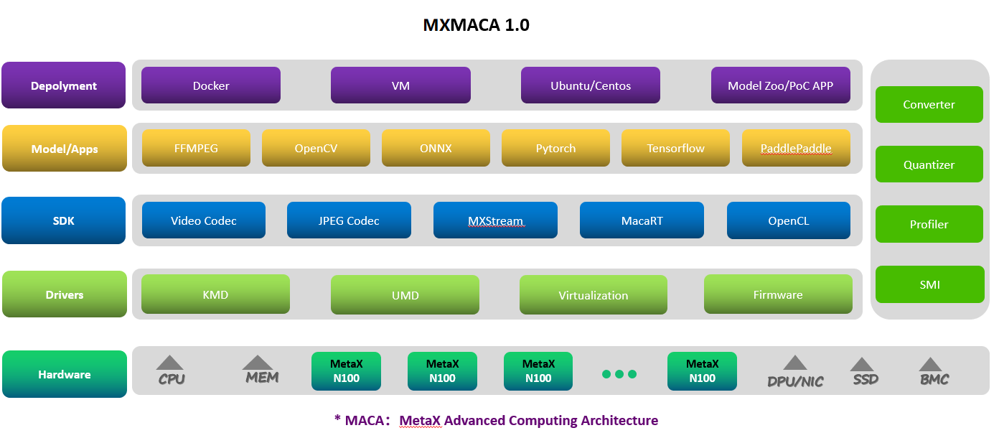

# 欢迎大家使用 MetaX ModelZoo
为方便更多开发者使用MetaX ModelZoo，我们后续将继续增加典型网络和相关预训练模型。
当前阶段支持部分开源onnx模型和paddlepaddle模型的预处理、推理及精度性能的测试。

# MetaX 沐曦软件栈结构
沐曦软件栈主要包括5层，从顶层到底层分别为：

# 技术支持
您可在[gitee社区](https://gitee.com/metax-tech_1/modelzoo/) 获取关于MetaX ModelZoo的最新讯息，并与其他开发者交流见解。
如果您对使用MetaX ModelZoo有疑问，或者在尝试MetaX ModelZoo过程中遇到问题，请尝试：到[gitee社区](https://gitee.com/metax-tech_1/modelzoo/) 与其他开发者进行交流；或者在[issues标签下](https://gitee.com/metax-tech_1/modelzoo/issues) 提问，有MetaX研发专家在线协助解决您的问题。

# 免责声明
MetaX ModelZoo仅提供公共数据集下载和预处理脚本。这些数据集不属于MetaX ModelZoo，MetaX ModelZoo也不对其质量或维护负责。请确保您具有这些数据集的使用许可。基于这些数据集训练的模型仅可用于非商业研究和教育。

致数据集所有者：

如果您不希望您的数据集公布在MetaX ModelZoo上或希望更新MetaX ModelZoo中属于您的数据集，请在Github/Gitee提交issue，我们将根据您的issue删除或更新您的数据集。衷心感谢您对我们社区的支持和贡献。

# 授权许可
MetaX ModelZoo经由[Apache license，version 2.0](https://gitee.com/metax-tech_1/modelzoo/blob/master/LICENSE) 授权许可。